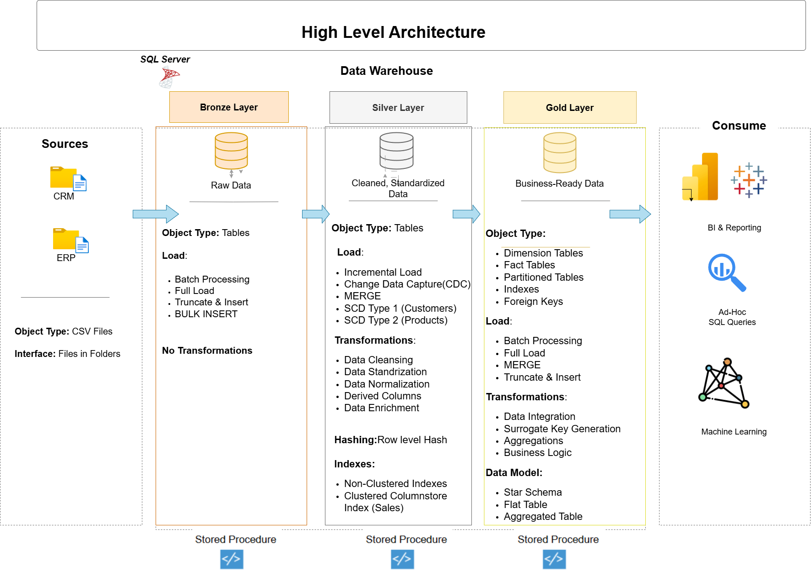

#  Enterprise SQL Data Warehouse And Analytics Project

### Medallion Architecture | Metadata-Driven ETL | Slowly Changing Dimensions 1 and 2 | Change Data Capture | Data Governance | Star Schema
---

## Overview

This project is an end-to-end **Data Warehouse solution** built using **Microsoft SQL Server**.

Data is extracted from **CRM and ERP source systems (CSV extracts)** and processed through a structured **Medellion architecture(Bronze → Silver → Gold** using **Stored Procedures**.

The system performs **ETL (Extract, Transform, Load)**, applies **Data Cleaning and Data Quality Checks**, builds a **Star Schema model**, and supports **Advanced SQL Analytics**. A centralized **Audit & Governance** Framework ensures data is tracked, monitored, and reliable.

### Core Capabilities

* Incremental Loading (Watermark Framework)
* SCD Type 1 and SCD Type 2
* HASHBYTES (SHA2_256) Change Detection
* Metadata-Driven ETL
* Partitioning & Clustered Columnstore Index
* Audit Logging & Data Quality Validation
* Master ETL Orchestration


##  Data Architecture

The data architecture for this project follows Medallion Architecture **Bronze**, **Silver**, and **Gold** layers:


---

## Project Structure

```
Enterprise-Data-Warehouse/
│
├── datasets/                      # Source CSV files (CRM & ERP)
│
├── docs/                          # Architecture diagrams & documentation
│
├── scripts/
│   ├── audit/                     # Audit schema objects
│   │   ├── ddl_audit.sql
│   │   └── seed_etl_config.sql
│   │
│   ├── bronze/                    # Bronze layer (Raw data load)
│   │   ├── ddl_bronze.sql
│   │   └── proc_load_bronze.sql
│   │
│   ├── silver/                    # Silver layer (Cleaning & transformation)
│   │   ├── ddl_silver.sql
│   │   └── proc_load_silver.sql
│   │
│   ├── gold/                      # Gold layer (Star schema & reporting)
│   │   ├── ddl_gold.sql
│   │   └── proc_load_gold.sql
│   │
│   ├── init_database.sql          # Database initialization
│   └── init_load_all.sql          # Master ETL procedure
│
├── tests/                         # Validation & test scripts
│
├── .gitignore
└── README.md
```

### Data Model


---

# ETL Workflow

## 1️. Bronze Layer – Raw Data Collection

**Source:** CRM and ERP CSV files
**Stored Procedure:** `bronze.load_bronze`

### What Happens Here

* BULK INSERT loads raw data
* Tables truncated before load
* Stores the data exactly as received (no changes)
* Batch ID generated for tracking
* Saves details of each load for record keeping in `audit.etl_log`
* TRY–CATCH error handling

### Data Quality – Bronze

* Tracks every data load using a Batch ID
* Logs errors during loading
* Prevents incomplete or partial data loads
* Data loads can be tracked for audit and monitoring

---

## 2️. Silver Layer – Data Cleaning & Transformation

**Stored Procedures:**

* `silver.load_silver`
* `silver.load_metadata_driven`

### Data Cleaning Performed

* **Duplicate Removal** (e.g., keep latest record using `ROW_NUMBER()`)
* **Missing Value Handling** (e.g., NULL customer_id flagged)
* **Code Standardization** (e.g., M → Male)
* **Invalid Date Correction** (e.g., wrong date set to NULL)
* **Revenue Validation** (e.g., Sales = Quantity × Price recalculated)
* **ID Cleanup** (e.g., remove extra spaces in customer_id)
* **Country Standardization** (e.g., USA → United States)
* **Data Format Consistency** (e.g., consistent date format YYYY-MM-DD)

### Data Quality – Silver

* Row Count Validation
* Mandatory Field Checks
* Revenue Match Check (Quantity × Price)
* Date Validation
* New Data Load Control (Incremental / Watermark)
* Duplicate Record Check
* Data Issue Logging & Tracking(`audit.data_quality_issues`)

### SCD & Load Logic

**Customers – SCD Type 1**

* MERGE statement
* Data Change Identification (HASHBYTES)
* Load Only New Data (Incremental Watermark)

**Products – SCD Type 2**

* Historical Data Tracking (Effective & Expiry Dates
* Current Record Indicator (is_current Flag)

**Sales – Delta Load**

* Load Only New Records (Watermark Filtering)
* Faster Query Performance (Clustered Columnstore)

**Metadata-Driven ERP Load**

* Table details stored in audit.etl_config
* Queries run dynamically (sp_executesql)
* Full Load (Truncate & Insert)
* 
---

## 3️. Gold Layer – Reporting & Star Schema Model

**Stored Procedure:** `gold.load_gold`

### Star Schema Design

**Dimension Tables**

* `gold.dim_customers`
* `gold.dim_products`
* Surrogate Keys
* Unknown Member Handling (-1)

**Fact Table**

* `gold.fact_sales`
* Partitioned by Year
* Clustered Primary Key
* Foreign Key Constraints
* Business intelligence-Optimized Structure

### Data Quality – Gold

* Referential Integrity Enforcement
* Foreign Key Validation
* Unknown Key Mapping (-1)
* Data partitions verified

---

## 4️.Data Analytics & Business Reporting

Advanced SQL analysis performed on Gold layer data using **aggregations, window functions, ranking, trend analysis, and segmentation**:

* Database & Dimension Exploration
* Measures & Date Range Analysis
* Ranking & Magnitude Analysis
* Change Over Time & Cumulative Analysis
* Performance & Segmentation Analysis
* Part-to-Whole Analysis
* Customer & Product Reporting
* Audit Analysis

---

# Audit & Control Framework

Schema: `audit`

* `audit.etl_log`
* `audit.watermark_thresholds`
* `audit.data_quality_issues`
* `audit.etl_config`
* Immediate ETL stop using THROW if critical errors happen

---

# Master ETL Execution

**Stored Procedure:** `init.load_all`

* Batch Initialization
* Configuration Validation
* Bronze → Silver → Gold Execution
* Success/Failure Logging
* Controlled End-to-End ETL Pipeline

---

## How to Run

1. Create and initialize the database
2. Deploy schemas and tables (`audit`, `bronze`, `silver`, `gold`)
3. Deploy all stored procedures
4. Execute the master ETL procedure:
   **EXEC init.load_all;**


---

**Author**: Utkarsh Reddy Nathala

**Linkedin**: https://www.linkedin.com/in/utkarsh-reddy-nathala-b5b56728a/

**Contact**: utkarshnathala@gmail.com , 8977011784
